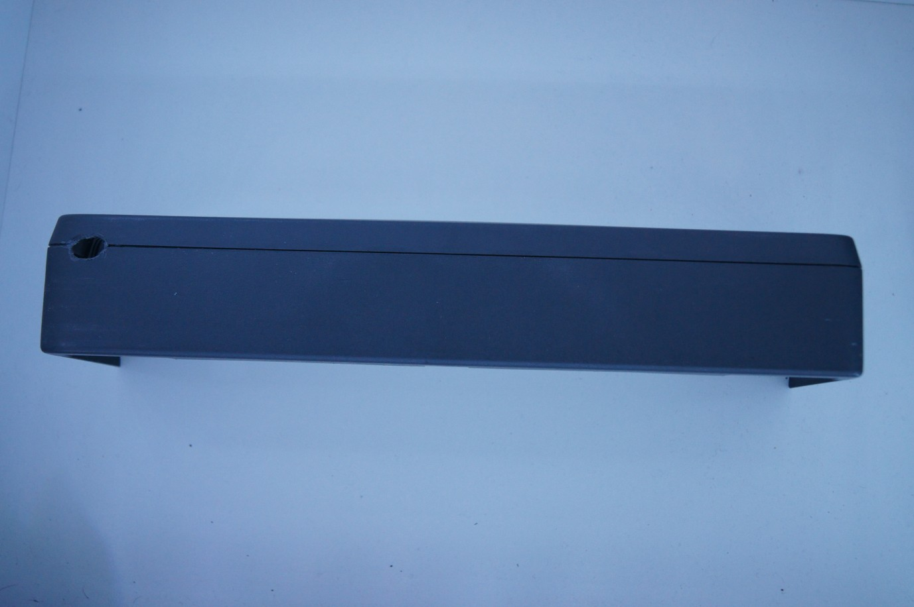
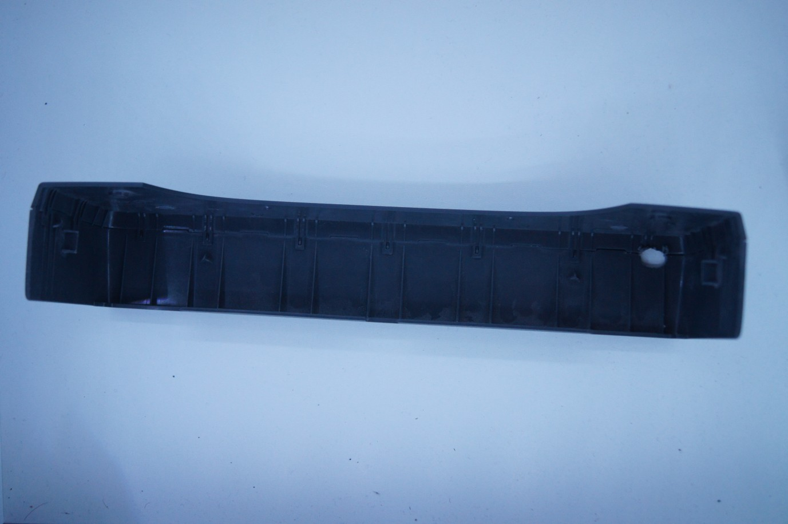
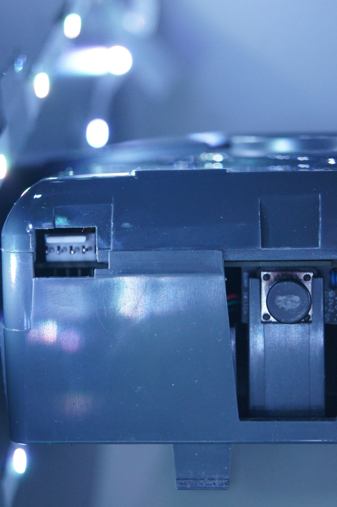
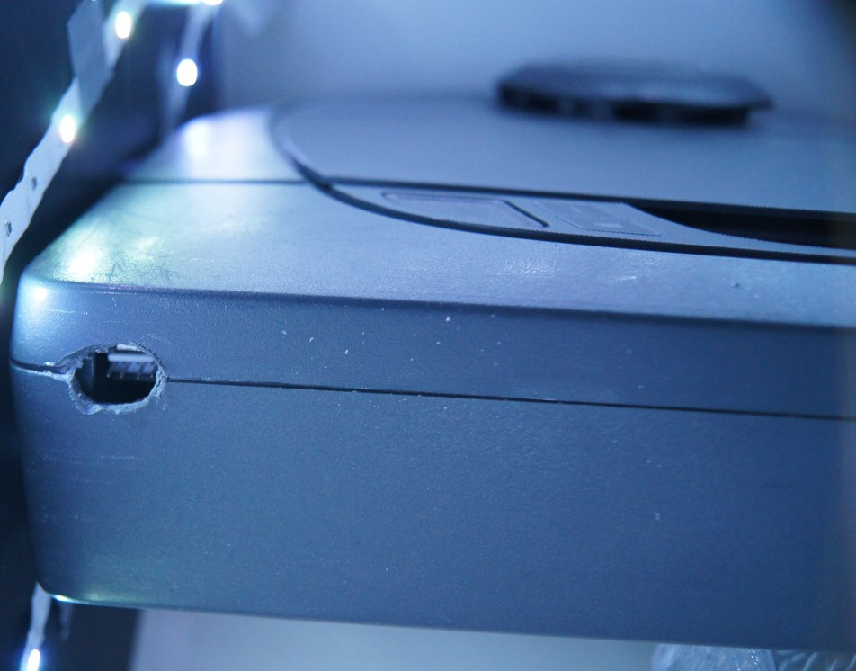
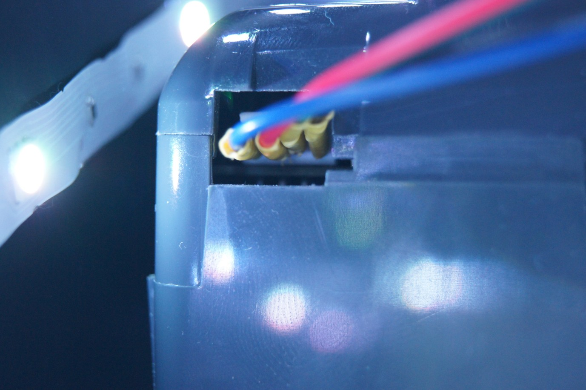
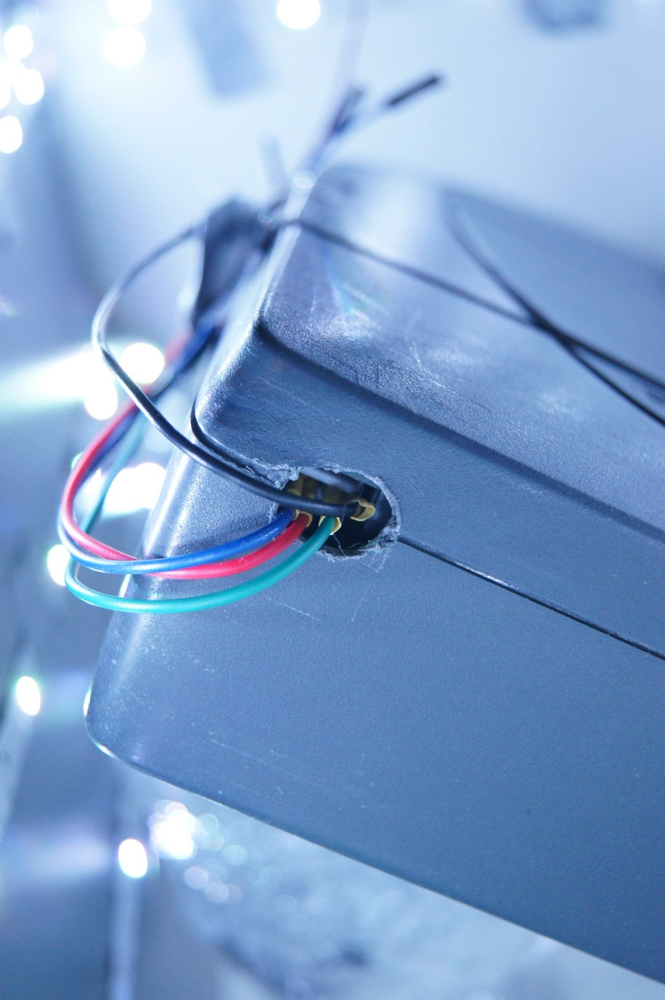

# How to connect to debug port

## Cables
Here you can find information on how to connect to the debug port in the easiest way. I only have a D3 and therefor can only show and verify on that, so if you have another robot and have done it, please tell me! The debug port for the D3/D4/D5/D7 is probably the same however.

I started with drilling a hole in the bumper;

Bumber front | Bumber back
:-------------------------:|:-------------------------:
 | 

Debug port | Debug port with bumber 
:-------------------------:|:-------------------------:
 |  

#### Connect some cables into this, they have JST crimps with some heatskrink to make sure they don't tech each other. 

Cable in bumper | Cables routed via hole in bumper
:-------------------------:|:-------------------------:
 |  

## ESP-device

Now you can connect this to an esp-device, for some reason I was not able to use the RX pin on any of my ESP devices, after a lot of debugging, I realized I had to put it on a another GPIO pin, I ended up using `GPIO13` on my esp32-cam, however I think I will use an esp32-dev-devboard that I have laying around later.

To install the the esphome config to the device, follow esphomes documentation.